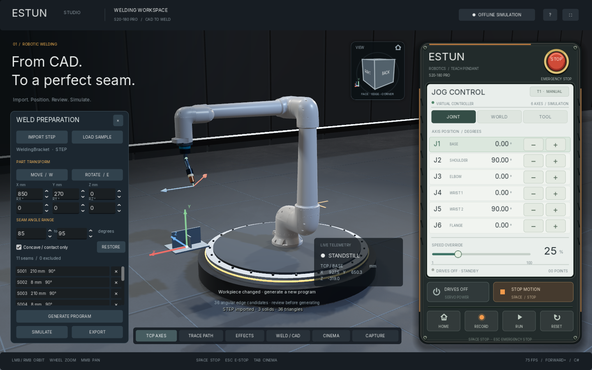
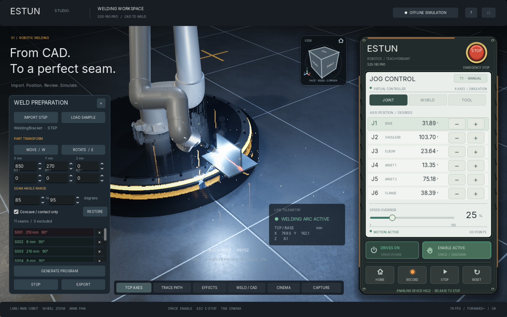

# ESTUN Weld Studio

A Windows robotic welding workspace built with **C# and Godot 4.5.1 .NET**. Import STEP assemblies, review angle-based seam candidates, position CAD with an interactive gizmo, generate checked robot trajectories, and simulate a mounted welding torch, arc, sparks, smoke and cooling weld beads.

The application uses the actual segmented **ESTUN S20-180 Pro** CAD model, an English interface and an original robot-arm icon. No Godot splash logo.





## Run

Extract the Windows archive from [GitHub Releases](https://github.com/liullinil/estun-weld-studio/releases) and launch **ESTUN Studio.exe**. Keep the adjacent **data_EstunStudio_windows_x86_64** and **CadRuntime** folders. No installed Godot, .NET or Python is needed. Windows 10/11 x64 and a Vulkan-capable GPU are required; a discrete GPU is recommended.

In the development workspace, run `Start.cmd` or `Launch.ps1`. The first launch compiles shaders.

## CAD to welding

1. **IMPORT STEP** opens a `.step` or `.stp` file. **LOAD SAMPLE** opens the included three-solid welding bracket.
2. Use **MOVE / W** and its X/Y/Z arrows, or **ROTATE / E** and its rotation rings. Numeric fields support millimeters and degrees. Escape cancels a drag.
3. Choose a seam angle range, such as **85–95 degrees**. Recognition uses adjacent BRep face normals, with sampling along curved edges. Contact edges between separate solids are also considered. **Concave / contact only** filters common fillet candidates.
4. Review candidates. Select an entry or click a seam in 3D. Its **×** button or **Delete** excludes it; **RESTORE** restores exclusions. The angle rule identifies geometric candidates, so operator review determines welding intent.
5. **GENERATE PROGRAM** searches paths. Amber means unplanned; green means a checked path was found; red means this planner found no valid path. Hover a list entry for the reason.
6. Enable **DRIVES**, then click **SIMULATE**. No key needs to be held. **Space / STOP MOTION**, Escape, loss of focus, workpiece edits or other robot motion stop playback. Arc is off during travel and on only during welding.
7. **EXPORT** writes JSON or CSV with joint angles, TCP poses, timings, arc state, seam IDs, tool and validation metadata.

Workpiece transformations, recognition changes and seam removal invalidate the old program. A changed robot start pose requires replanning. Playback cannot start during planning/import. After interruption, generate again from the current pose.

## What the planner checks

Route ordering uses nearest endpoints and 2-opt improvement. The planner tests multiple torch rolls, approach inclinations and IK branches, samples seam geometry and normals, checks approach/retraction, and searches lifted and side transfer alternatives.

Collision checks include the workpiece, non-adjacent robot links, torch, mounting platform and floor. Actual source-mesh slices supply conservative robot bounds. Capsule broad phase and oriented-box narrow phase are combined with a CAD triangle BVH and solid-containment checks. Motion is sampled at maximum summed joint increments of **0.032 degrees**, with a **2 mm margin**. Playback follows that same interpolation and rechecks each applied pose. Adjacent bearing interfaces are intentionally excluded from self-collision checks.

This is **heuristic offline planning**, not proof of global optimality or continuously collision-free motion for all geometry. Conservative bounds can reject feasible welds. Red means no path was found with the available choices; it does not prove that no other industrial strategy exists. Features below tessellation/sampling tolerance, additional fixtures, flexible hoses, physical calibration and dynamics require further validation.

**The JSON/CSV export is an offline program representation, not ESTUN controller-ready NC code.** Hardware use needs a controller-specific postprocessor and calibrated tool/workobject/cell definitions. This app has no robot communication and cannot command physical equipment.

On the included bracket at its default placement: **5 ready / 6 blocked**, **152 moves**, approximately **25 seconds** at full simulation speed. A complete **210 mm** seam is processable. The central rib blocks other candidate paths. The final full collision test planned this sample in about 75 seconds on the development computer; time varies by hardware and geometry.

## Cube, gizmo and effects

The rotating view cube offers **26 face, edge and corner views**, mouse orbit and home. Left/right drag in free viewport orbits; middle drag pans; wheel zooms. F resets, F11 toggles fullscreen, F12 captures to Pictures/ESTUN Studio, Tab opens clean camera orbit. W/E selects move/rotate; Delete excludes a selected seam.

**Display** provides SSAO, SSIL, reflections, shadows, haze, bloom and intensity, exposure, MSAA, TAA, depth of field, sparks, smoke and weld-bead detail. Settings persist locally. **DOF and TAA are off by default; MSAA is 2×.** RESET TO CRISP restores a sharp inspection image. Background blur is opt-in.

Stable HDR and a 1024-pixel room reflection probe provide material highlights. The probe captures only the fixed room, excluding the moving robot, workpiece, overlays and nearby mounting platform. **Screen-space reflections and screen-space bounce are off by default** to avoid silhouette gaps, pixelated reflections and frozen reflection ghosts; both remain optional effects. Existing settings are migrated once while retaining exposure, bloom and other preferences. Painted housings and concrete are dielectric materials, and the platform has a satin finish.

**Fullscreen performance:** the 1024-pixel reflection atlas is limited to four slots rather than the engine default of 64. This reduces its reserved GPU memory from roughly 4 GiB to 256 MiB without reducing reflection resolution. The optional **Display → 3D resolution → Auto** keeps scene rendering near the 1440×900 window pixel budget when maximizing, entering fullscreen or using a high-DPI display. Spatial FSR scales only 3D; text, pendant controls and CAD picking retain their native display resolution. **Native**, now the default, uses full display-resolution 3D, and **Manual** exposes a 25–100% scale. At very high resolutions Auto trades some fine 3D detail for performance. TAA and depth of field remain optional and are not enabled by scaling.

The workspace now uses **native pixels**, with no fractional canvas scaling. Hide either sidebar; **P** toggles the pendant and the toolbar restores it. The camera recenters when a dock closes. Robot rendering defaults to **Native 100%**; exact internal dimensions are visible in the footer and Display panel. Existing blur-heavy settings migrate once to the sharp preset.

Lossless CAD indexing reduced display vertex entries by **78.8%** while retaining every source triangle and normal. Two shadow-casting studio lights replace five, with fill lights retained. Short benchmark on the development RTX 3060 Laptop: **159.8 FPS** in a 1440×900 window and **106.9 FPS** at native 1920×1080 fullscreen (VSync disabled for measurement). Results depend on hardware and loaded geometry. See [native UI and rendering notes](docs/NATIVE-UI.md).

The stage uses HDR reflections, metal PBR, ACES tone mapping and studio lights. Welding adds flickering arc illumination, spatter, rising smoke and a visible deposited bead that cools from incandescent metal. Thermal distortion and physical metallurgy are not simulated.

## Teach pendant

Enable DRIVES and hold an on-screen −/+ key or Left/Right to jog; release the jog control to stop. Up/Down selects an axis. **HOME, RUN and SIMULATE start with one click**, without holding Space. **Space is a stop shortcut**, and the former enabling-device button is now **STOP MOTION**. JOINT moves one motor, WORLD jogs the TCP in base coordinates and TOOL uses the tool frame. RESET clears E-stop and leaves drives off. Focus loss stops motion; returning to the window never resumes it automatically.

TCP is now the torch wire tip with an explicit transform from the native flange. Coordinates are right-handed Y-up, position in millimeters, orientation using Godot YXZ Euler decomposition. A/B/C jog rotates about X/Y/Z; it is not KUKA's native ABC convention.

Pendant recordings: `%APPDATA%/Godot/app_userdata/ESTUN Studio/estun_s20_180_pro_torch_waypoints.json`. Weld program exports use the path selected in the save dialog.

## Build from source

```powershell
git clone https://github.com/liullinil/estun-weld-studio.git
cd estun-weld-studio
.\tools\Setup.ps1
.\Launch.ps1
```

Setup downloads the official Godot .NET editor, .NET 8 SDK and isolated CAD runtime into `.tools`, then builds and imports assets. `Launch.ps1 -Editor` opens the local .NET editor. Standard non-.NET Godot cannot build C#.

The app, UI, robot control, kinematics, collision checking, optimization, playback and effects are **C#**. STEP uses an isolated **OpenCascade geometry worker** through Python 3.11.9/OCP 7.7.2.2b2 and its VTK native dependency. Python is only the CAD-kernel adapter, bundled in portable releases. `SetupCad.ps1` verifies pinned download SHA256 hashes; it uses no system Python or pip.

```powershell
.\.tools\dotnet\dotnet.exe build .\EstunStudio.csproj
.\tools\SetupCad.ps1
# Export after installing official Godot Mono Windows templates in:
# .tools/templates/4.5.1.stable.mono
.\tools\Export.ps1
```

Export runs all configured Godot test scenes and copies the CAD runtime. `.tools`, temporary research, native reference archives and test screenshots are excluded from Git.

## Validation

Verified with actual STEP input and the shipping Main scene:

| Suite | Checks |
| --- | ---: |
| Robot kinematics and interlocks | 71 |
| Actual robot, torch and pendant scene | 69 |
| View cube and effect controls | 86 |
| CAD transform gizmo | 45 |
| C# STEP import service | 11 |
| Collision geometry and all generated sample segments | 336 |
| End-to-end CAD/planning/playback/edit lifecycle | 28 |
| Native OpenCascade tests | 7 |
| Full CAD geometry preservation | 49 |
| Native pendant layout | 45 |
| Native workspace layout and dock interactions | 78 |

Fullscreen regression checks additionally cover GPU reflection-memory allocation, 1080p/1440p/4K pixel budgets, live resize with the settings panel hidden, mode persistence and unchanged UI/camera picking transforms. `Tests/RenderBenchmark.tscn` optionally measures windowed, maximized and fullscreen modes on the actual GPU.

The native tests include inch/mm conversion, rotated/translated assemblies, circular and non-right-angle edges, face normals, contact seams and invalid input. Workflow tests cover cancellation, busy-state races, stale-program invalidation, moved start pose, E-stop and actual gizmo drag.

```powershell
$env:DOTNET_ROOT = (Resolve-Path .tools/dotnet).Path
$engine = '.\.tools\godot\Godot_v4.5.1-stable_mono_win64\Godot_v4.5.1-stable_mono_win64_console.exe'
foreach ($test in 'RobotChecks','SceneChecks','ViewportChecks','GizmoChecks','CadImportChecks','WeldChecks','WeldingWorkflowChecks') {
    & $engine --headless --path . ("res://Tests/$test.tscn")
}
.\.tools\cad-python\python.exe Tests/CadImportChecks.py
```

Import limits are explicit: 256 MB STEP input and bounded tessellation, edge sampling and contact search. Incomplete recognition is reported rather than silently represented as complete.

## Model and attribution

The actual ENCY S20-180 Pro geometry contains **514,833 triangles** and seven articulated links. Its catalogue GUID, source transforms and conversion are documented in [Assets/Robot/REFERENCE.md](Assets/Robot/REFERENCE.md). RoboDK Eco was inspected separately and is not substituted for Pro.

The CAD remains third-party data; this private repository does not assert redistribution rights. The icon, pendant interface, welding torch and sample bracket are original project assets. See [THIRD_PARTY.md](THIRD_PARTY.md) and [CAD runtime licenses](tools/CadRuntime-LICENSES.txt).
